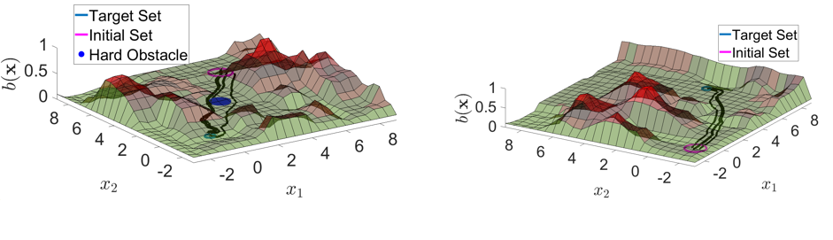
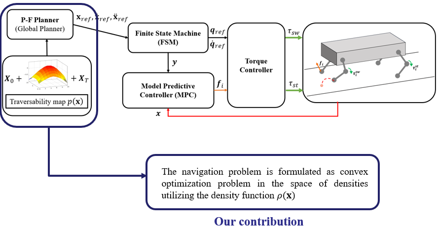

## Overview
The code in this repository considers the problem of optimal control design for navigation on off-road terrain. We use a traversability measure to characterize the difficulty of navigation on off-road terrain. The traversability measure captures terrain properties essential for navigation, such as elevation maps, roughness, slope, and texture. We provide a convex formulation to the off-road navigation problem by lifting the problem to the density space using the linear Koopman and Perron-Frobenius (P-F) operators. Our convex framework is then implemented for path planning of the legged robots in an unstructured environment. Please look at [paper 1](https://ieeexplore.ieee.org/abstract/document/10081458) and [paper 2](https://www.sciencedirect.com/science/article/pii/S2405896323024254) for high-level details of the framework.

## Legged robot locomotion
The quadruped navigation is a two-stage hierarchical process that involves a **global planner** and a **local controller**. The global planner is used to come up with state trajectories in terms of positions and velocity. Our framework is utilized in the global planner stage for trajectory planning for off-road terrain. The P-F planner incorporates Koopman operator theory to get a convex optimization, where the following solution is a feedback controller used as an optimal reference trajectory for traversing the unstructured environment. For the local planner stage, we use the `Quad-SDK` framework. 

## Quad-SDK

We use `Quad-SDK` for producing leg torque control in the local planner stage of the quadruped navigation. `Quad-SDK` is an open-source, ROS-based full-stack software framework for agile quadrupedal locomotion. Refer to [QUad-SDK Github page](https://github.com/robomechanics/quad-sdk?tab=readme-ov-file) for installation, dependency, and unit testing information on the software. 

## Examples
We present two off-road terrain navigation for quadruped locomotion: `C-shaped_terrain` and `hill_and_pit`. By running the files `C-shaped_terrain/Global_planner_C_shaped_terrain.m` and `hill_and_pit/Global_planner_hill_pit.m`, we obtain the optimal trajectory in terms of position and velocity which is then fed to `Quad-SDK` framework to generate leg torque control.

### C-shaped terrain
<video src='videos/C_shaped_PF_planner.mp4' width=180/>
### Hill and pit
